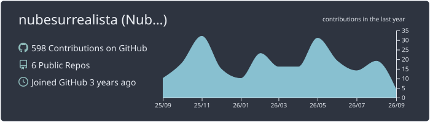
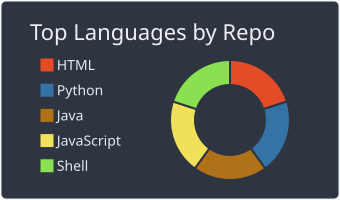
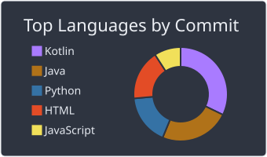
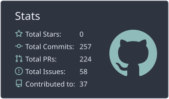
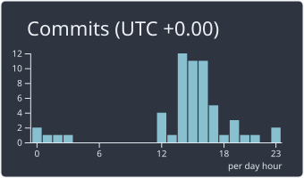

# Nube - 云

### Traduciendo cosas que me gustan - Translating things I like - 翻译我喜欢的东西
**ES/EN/CN?**

## Última publicación en mi blog - Last blog post - 我博客的最后一篇
[Cambiar servicios en la nube por software sin conexión](https://nube.codeberg.page/blog/offline/)
